# AlertManager Guide

Complete guide to AlertManager architecture, Discord bridge integration, and alternative notification channels.

## Overview

AlertManager handles alert routing, grouping, and deduplication from Prometheus, then dispatches them to notification channels like Discord, Slack, email, or PagerDuty.

```mermaid
flowchart TD
    subgraph Prometheus["📊 Prometheus Server"]
        Rules["Alert Rules<br/>(DailyCostReport,<br/>CostAnomaly)"]
        Eval["Rule Evaluation<br/>Every 30s"]
        State["Alert State<br/>(pending → firing)"]
    end
    
    subgraph AlertManager["🚨 AlertManager<br/>kube-prometheus-stack-alertmanager"]
        Dispatcher["Dispatcher<br/>Processes alerts"]
        Grouping["Grouping & Silencing<br/>group_by labels<br/>Silence inactive alerts"]
        Router["Router<br/>Matches receivers<br/>based on labels"]
        Dedup["Deduplication<br/>Avoid duplicate<br/>notifications"]
    end
    
    subgraph Discord["🤖 Discord Bridge<br/>alertmanager-discord<br/>:9094"]
        Webhook["Webhook Receiver<br/>POST /"]
        Format["Message Format<br/>Alert title + details"]
        Send["Send to Discord<br/>via webhook_url"]
    end
    
    subgraph External["💬 Communication"]
        DiscordServer["Discord Server<br/>Cost Alerts Channel"]
        Email["📧 Email Server<br/>SMTP"]
        Slack["💙 Slack Workspace<br/>Incoming Webhook"]
        PagerDuty["🚨 PagerDuty<br/>Incident Manager"]
    end
    
    subgraph Config["⚙️ Configuration<br/>helm/kube-prometheus-stack/values.yaml"]
        Route["Routes:<br/>match: category=cost<br/>group_interval: 24h<br/>repeat_interval: 24h"]
        Receiver["Receivers:<br/>discord-cost-alerts<br/>webhook_url: http://...:9094"]
        Secret["Vault:<br/>vault_discord_webhook_url"]
    end
    
    Rules -->|"Fires when<br/>cost > threshold"| Eval
    Eval -->|"State: firing"| State
    State -->|"Every 30s<br/>evaluation"| Dispatcher
    
    Dispatcher -->|"Groups by<br/>alertname,severity"| Grouping
    Grouping -->|"group_wait: 1m<br/>group_interval: 24h"| Dedup
    Dedup -->|"Routes to<br/>matching receiver"| Router
    
    Router -->|"Match:<br/>category: cost"| Webhook
    Webhook -->|"POST<br/>Alert JSON"| Format
    Format -->|"Discord embed<br/>title + alert details"| Send
    Send -->|"Discord Webhook<br/>Secret"| DiscordServer
    
    Config -.->|"Configures"| AlertManager
    Secret -.->|"Provides<br/>webhook URL"| Discord
    
    classDef prometheus fill:#fff3e0,stroke:#e65100,color:#000
    classDef alertmgr fill:#ffebee,stroke:#c62828,color:#000
    classDef discord fill:#4a90e2,stroke:#2c5aa0,color:#fff
    classDef config fill:#f3e5f5,stroke:#6a1b9a,color:#000
    classDef external fill:#e8f5e9,stroke:#2e7d32,color:#000
    classDef alt fill:#fff9c4,stroke:#f57f17,color:#000
    
    class Prometheus prometheus
    class AlertManager,Dispatcher,Grouping,Router,Dedup alertmgr
    class Webhook,Format,Send discord
    class Route,Receiver,Secret config
    class External,DiscordServer external
    class Email,Slack,PagerDuty alt
```



---

## How It Works: Three-Stage Alert Flow

### 1️⃣ Prometheus: Alert Generation

**Location:** `kube-prometheus-stack-prometheus-0` pod in `monitoring` namespace

**Evaluation Process:**
- Every 30 seconds, Prometheus evaluates all alert rules
- When metric exceeds threshold (e.g., `do_cost_exporter_daily_cost > 100`), alert fires
- Alert state transitions: `inactive` → `pending` (15s) → `firing`

**Rules in Duli:**
- `DailyCostReport` - Sends daily cost summary
- `DailyDigitalOceanCostAlert` - DigitalOcean infrastructure breakdown
- `CostAnomalyDetected` - Fires when cost deviates >25% from 7-day average

```yaml
# Example: Daily cost rule from helm/do-cost-exporter/templates/prometheusrule.yaml
groups:
  - name: cost-monitoring
    rules:
      - alert: DailyCostReport
        expr: do_cost_exporter_daily_cost > 0
        for: 1m
        annotations:
          summary: "Daily cost is {{ $value | humanize }}"
```

### 2️⃣ AlertManager: Routing & Deduplication

**Location:** `alertmanager-kube-prometheus-stack-alertmanager-0` pod in `monitoring` namespace

**Process:**
1. **Receives** alert JSON from Prometheus every 30s
2. **Groups** alerts by labels (`alertname`, `severity`, etc.)
3. **Silences** matching alerts if silences are active
4. **Deduplicates** to avoid sending same alert multiple times
5. **Routes** to matching receiver based on label matchers

**Configuration** (from `helm/kube-prometheus-stack/values.yaml`):

```yaml
alertmanager:
  config:
    routes:
      - receiver: 'discord-cost-alerts'
        group_by: ['alertname', 'severity']
        group_wait: 1m              # Wait 1 min to batch multiple alerts
        group_interval: 24h         # Re-send grouped alerts every 24h
        repeat_interval: 24h        # Send once per 24 hours
        match:
          category: 'cost'          # Only route alerts with label category=cost
    
    receivers:
      - name: 'discord-cost-alerts'
        webhook_configs:
          - url: 'http://alertmanager-discord.monitoring.svc.cluster.local:9094'
            send_resolved: true
```

**Key Timing Settings:**
- `group_wait: 1m` - Batches alerts arriving within 1 minute
- `group_interval: 24h` - Waits 24 hours before re-sending grouped alerts
- `repeat_interval: 24h` - Resends alert once per day (so you get daily cost updates)

### 3️⃣ Discord Bridge: Notification Delivery

**Location:** `alertmanager-discord` pod in `monitoring` namespace

**Service Details:**
- Helm Chart: `helm/alertmanager-discord/`
- Container Port: `9094`
- Endpoint: `http://alertmanager-discord.monitoring.svc.cluster.local:9094`
- Discord Webhook: Stored in `vault.yml` as `vault_discord_webhook_url`

**How it Works:**
1. Receives webhook POST from AlertManager containing alert JSON
2. Parses alert metadata (name, labels, annotations, value)
3. Formats as Discord embed (title, description, color based on severity)
4. Sends HTTP POST to Discord webhook URL
5. Message appears in your Discord channel

**Example Discord Message:**
```
⚠️ DailyCostReport
───────────────────
Daily cost is $125.50

Severity: warning
Alertname: DailyCostReport
Environment: prod
```

---

## Notification Channel Comparison

```mermaid
graph LR
    AM["AlertManager<br/>Webhook Route"]
    
    AM -->|"HTTP POST<br/>Alert JSON"| Discord["🤖 Discord Bridge<br/>benjojo/alertmanager-discord<br/><br/>• Custom Helm chart<br/>• Translates alerts to<br/>  Discord embeds<br/>• Requires:<br/>  vault_discord_webhook_url"]
    
    AM -->|"Native Support<br/>No bridge needed"| Slack["💙 Slack Integration<br/>AlertManager built-in<br/><br/>• Config: slack_api_url<br/>• Formats for Slack<br/>• Simpler setup"]
    
    AM -->|"Native Support<br/>SMTP enabled"| Email["📧 Email Alerting<br/>AlertManager built-in<br/><br/>• Config: smtp_smarthost<br/>• Sends to email addresses<br/>• Great for critical alerts"]
    
    AM -->|"Native Support<br/>or Bridge"| PagerDuty["🚨 PagerDuty<br/>AlertManager integration<br/><br/>• Incident escalation<br/>• On-call routing<br/>• Severity-based rules"]
    
    AM -->|"Custom Webhook<br/>or HTTP POST"| Custom["🔌 Other Services<br/>Generic webhook receiver<br/><br/>• Telegram bots<br/>• MS Teams<br/>• Custom Python/Node app"]
    
    classDef custom fill:#4a90e2,stroke:#2c5aa0,color:#fff
    classDef builtin fill:#81c784,stroke:#388e3c,color:#fff
    classDef flexible fill:#ffb74d,stroke:#f57c00,color:#fff
    
    class Discord custom
    class Slack,Email,PagerDuty builtin
    class Custom flexible
```



### Detailed Comparison

| Channel | Setup | Pros | Cons | Best For |
|---------|-------|------|------|----------|
| **Discord** | Custom bridge (existing in Duli) | Developer-friendly, emoji support, rich embeds, threaded | Extra service to maintain, custom code | Team communication, casual alerts |
| **Slack** | Native AlertManager config | Built-in, simple, enterprise-ready, powerful formatting | Requires Slack workspace, message limits | Professional teams, scheduled alerts |
| **Email** | SMTP settings (built-in) | No 3rd party service needed, guaranteed delivery | Can get spammy, poor formatting, manual action required | Critical alerts, off-hours escalation |
| **PagerDuty** | Integration key + AlertManager config | On-call escalation, incident tracking, severity routing | Paid service, overkill for informational alerts | Critical incidents, SLA tracking |
| **Telegram Bot** | Custom bridge | Instant notifications, personal alerts, low latency | Requires bot development, security considerations | Individual on-call engineers |

---

## Switching to a Different Channel

### 🔄 Discord → Slack

Edit `helm/kube-prometheus-stack/values.yaml`:

```yaml
alertmanager:
  config:
    routes:
      - receiver: 'slack-cost-alerts'
        # ... other settings same
    
    receivers:
      - name: 'slack-cost-alerts'
        slack_configs:
          - api_url: '{{ vault_slack_webhook_url }}'  # Add to vault.yml
            channel: '#cost-alerts'
            title: '{{ .GroupLabels.alertname }}'
            text: '{{ range .Alerts }}{{ .Annotations.description }}{{ end }}'
```

Then delete the Discord bridge:
```bash
kubectl delete application alertmanager-discord -n argocd
```

### 📧 Add Email Alerts

Edit `helm/kube-prometheus-stack/values.yaml`:

```yaml
alertmanager:
  config:
    global:
      smtp_smarthost: 'smtp.gmail.com:587'
      smtp_auth_username: 'your-email@gmail.com'
      smtp_auth_password: '{{ vault_smtp_password }}'
    
    routes:
      - receiver: 'email-critical'
        group_by: ['alertname']
        match:
          severity: 'critical'
    
    receivers:
      - name: 'email-critical'
        email_configs:
          - to: 'ops-team@company.com'
            from: 'alerts@company.com'
```

### 🚨 Add PagerDuty Escalation

Edit `helm/kube-prometheus-stack/values.yaml`:

```yaml
alertmanager:
  config:
    receivers:
      - name: 'pagerduty-critical'
        pagerduty_configs:
          - service_key: '{{ vault_pagerduty_service_key }}'
            severity: '{{ if eq .Status "firing" }}critical{{ else }}resolve{{ end }}'
```

---

## Architecture: Why Discord Bridge?

The Discord bridge (`benjojo/alertmanager-discord`) exists because:

1. **AlertManager has no Discord support natively** - Discord webhooks aren't a built-in receiver type
2. **The bridge translates Alert JSON → Discord embeds** - Pretty formatting that humans can read
3. **Duli uses it for team communication** - Cost alerts fit naturally in a `#cost-monitoring` channel
4. **Cost reports are informational** - Not time-critical like infrastructure alerts, so daily batching works well

Alternative: You could skip the bridge and POST directly to Discord webhooks using a simple webhook receiver, but the bridge provides better formatting.

---

## Common Configuration Patterns

### Pattern 1: Different Routes by Severity

```yaml
alertmanager:
  config:
    routes:
      - receiver: 'discord-critical'
        match:
          severity: 'critical'
        repeat_interval: 1h
      
      - receiver: 'discord-warning'
        match:
          severity: 'warning'
        repeat_interval: 24h
      
      - receiver: 'null'  # Silently drop info alerts
        match:
          severity: 'info'
```

### Pattern 2: Multiple Channels for Same Alert

```yaml
alertmanager:
  config:
    routes:
      - receiver: 'discord-cost'
        match:
          category: 'cost'
      
      - receiver: 'slack-cost'
        match:
          category: 'cost'
      
      - receiver: 'email-critical'
        match:
          severity: 'critical'
          category: 'cost'
```

### Pattern 3: Silence During Maintenance

```bash
# Silence all alerts for 2 hours
kubectl exec -n monitoring alertmanager-kube-prometheus-stack-alertmanager-0 -- \
  amtool silence add -c "Maintenance window" -d 2h

# Or silence specific alerts
kubectl exec -n monitoring alertmanager-kube-prometheus-stack-alertmanager-0 -- \
  amtool silence add -m alertname=DailyCostReport -d 4h
```

---

## Customizing Discord Messages

The Discord message comes from two places: **Prometheus alert annotations** and **Discord bridge formatting**.

### 1. Alert Annotations (Data Layer)

Add custom fields to your Prometheus alert rules. These become available to Discord bridge:

```yaml
# helm/do-cost-exporter/templates/prometheusrule.yaml
groups:
  - name: cost-monitoring
    rules:
      - alert: DailyCostReport
        expr: do_cost_exporter_daily_cost > 0
        for: 1m
        labels:
          severity: warning
          category: cost
        annotations:
          summary: "Daily Cost Report"
          description: "Current daily cost: ${{ $value | humanize }}"
          dashboard: "https://grafana.duli.one/d/cost-monitoring"
          runbook: "https://wiki.company.com/cost-management"
          component: "kubernetes"
          environment: "{{ $labels.environment }}"
          cost_threshold: "100"
```

**Available in Discord:**
- `$value` - The metric value (e.g., 125.50)
- `$labels.*` - Any label from the metric (e.g., environment, severity)
- Custom annotations - Any text you add above

### 2. Discord Bridge Message Formatting

The Discord bridge (benjojo/alertmanager-discord) formats alerts as embeds. Customize via Helm chart:

**Default (Current):**
```yaml
# helm/alertmanager-discord/values.yaml
discord:
  webhook_url: "{{ vault_discord_webhook_url }}"
  # Default formatting uses alert title + annotations
```

**Custom Message Template:**

Edit `helm/alertmanager-discord/templates/deployment.yaml` to add environment variables controlling output:

```yaml
apiVersion: apps/v1
kind: Deployment
metadata:
  name: alertmanager-discord
spec:
  template:
    spec:
      containers:
      - name: alertmanager-discord
        image: benjojo/alertmanager-discord:latest
        env:
        - name: DISCORD_WEBHOOK
          valueFrom:
            secretKeyRef:
              name: alertmanager-discord-secret
              key: webhook-url
        # Add custom formatting (check benjojo/alertmanager-discord docs)
```

### 3. Real Example: Customized Cost Alert

Current setup shows:
```
⚠️ DailyCostReport
───────────────────
Daily cost: $125.50
```

To customize to show more details, update the alert rule:

```yaml
# helm/do-cost-exporter/templates/prometheusrule.yaml
- alert: DailyCostReport
  expr: do_cost_exporter_daily_cost > 0
  for: 1m
  labels:
    severity: warning
    category: cost
  annotations:
    summary: "💰 Daily Cost Alert"
    description: |
      Current cost: **${{ $value | humanize }}/day**
      
      • **K8s Cost**: {{ $labels.k8s_cost }}
      • **Infrastructure**: {{ $labels.do_cost }}
      • **Trend**: {{ $labels.cost_trend }}
      
      📊 [View Dashboard](https://grafana.duli.one/d/cost)
      📖 [View Runbook](https://wiki.company.com/cost-runbook)
    component: "cost-monitoring"
    environment: "{{ $labels.environment }}"
```

### 4. Message Customization Options

| Field | Source | Example |
|-------|--------|---------|
| **Title/Summary** | Alert `summary` label | "💰 Daily Cost Alert" |
| **Description** | Alert `description` annotation | Supports markdown with links |
| **Color** | Alert `severity` label | Red=critical, Orange=warning, Green=resolved |
| **Fields** | Custom annotations | Any text you add as annotation |
| **Links** | Annotation text (markdown) | `[Dashboard](https://grafana.duli.one/d/cost)` |
| **Emojis** | In summary/description | ✅ 💰 🚨 📊 |

### 5. Markdown Support in Discord

Discord embeds support markdown in descriptions:

```markdown
**Bold text** for emphasis
*Italic text* for secondary info
`code` for values
[Link text](https://example.com) for clickable links
> Quoted text for callouts

• Bullet points
• For lists
```

**Example description with markdown:**
```yaml
description: |
  ⚠️ **Daily Cost Exceeded Threshold**
  
  Current Cost: `${{ $value }}`
  Budget: `$150/day`
  
  **Breakdown:**
  • Kubernetes: $45.50
  • DigitalOcean: $68.20
  • Other: $12.30
  
  [View Cost Dashboard](https://grafana.duli.one/d/cost-monitoring)
  [View Alerts](https://prometheus.duli.one/alerts)
```

### 6. Dynamic Message by Severity

Route different messages based on alert severity:

```yaml
# helm/kube-prometheus-stack/values.yaml
alertmanager:
  config:
    routes:
      # Critical alerts get special formatting
      - receiver: 'discord-critical'
        match:
          severity: 'critical'
        repeat_interval: 1h
      
      # Warning alerts batched daily
      - receiver: 'discord-warning'
        match:
          severity: 'warning'
        repeat_interval: 24h
      
      # Info alerts silent
      - receiver: 'null'
        match:
          severity: 'info'

    receivers:
      - name: 'discord-critical'
        webhook_configs:
          - url: 'http://alertmanager-discord.monitoring.svc.cluster.local:9094'
      
      - name: 'discord-warning'
        webhook_configs:
          - url: 'http://alertmanager-discord.monitoring.svc.cluster.local:9094'
```

### 7. Test Custom Message

Deploy changes:
```bash
cd infrastructure-kubernetes/ansible
ansible-playbook -i inventories/hosts.ini playbooks/install_infrastructures.yml \
  -e target_environment=staging \
  -e "ansible_tags=helm_kube_prometheus_stack"
```

Then trigger test alert:
```bash
# Port-forward Prometheus
kubectl port-forward -n monitoring svc/kube-prometheus-stack-prometheus 9090:9090

# Visit http://localhost:9090/alerts and check your alert appears with new formatting
```

---

## Troubleshooting

### Alerts not appearing in Discord

```bash
# 1. Check AlertManager is receiving alerts from Prometheus
kubectl port-forward -n monitoring svc/kube-prometheus-stack-prometheus 9090:9090
# Navigate to http://localhost:9090/alerts → Check if alert state is "firing"

# 2. Check AlertManager config
kubectl get secret -n monitoring alertmanager-kube-prometheus-stack -o jsonpath='{.data.alertmanager\.yaml}' | base64 -d | grep -A5 "discord"

# 3. Check Discord bridge logs
kubectl logs -n monitoring -l app.kubernetes.io/name=alertmanager-discord --tail=100

# 4. Verify webhook URL
kubectl get secret alertmanager-discord-secret -n monitoring -o jsonpath='{.data.webhook-url}' | base64 -d

# 5. Test AlertManager webhook directly
kubectl port-forward -n monitoring svc/alertmanager-kube-prometheus-stack 9093:9093
# Send test alert via HTTP
```

### Discord bridge pod crashing

```bash
# Check resource limits
kubectl describe pod -n monitoring -l app.kubernetes.io/name=alertmanager-discord

# Check events
kubectl get events -n monitoring --sort-by='.lastTimestamp'

# View logs
kubectl logs -n monitoring -l app.kubernetes.io/name=alertmanager-discord --previous
```

### Alerts firing constantly

```bash
# Check cardinality of alert rule
kubectl port-forward -n monitoring svc/kube-prometheus-stack-prometheus 9090:9090
# Run: do_cost_exporter_daily_cost

# If high cardinality, check metric labels:
curl http://localhost:9090/api/v1/query?query=count(do_cost_exporter_daily_cost)
```

---

## Files Reference

| File | Purpose |
|------|---------|
| `helm/kube-prometheus-stack/values.yaml` | AlertManager config, routes, receivers |
| `helm/alertmanager-discord/Chart.yaml` | Discord bridge metadata |
| `helm/alertmanager-discord/templates/` | Discord bridge deployment, service |
| `helm/do-cost-exporter/templates/prometheusrule.yaml` | Cost alert rules |
| `ansible/inventories/group_vars/all/vault.yml` | `vault_discord_webhook_url` secret |
| `gitops/applications/alertmanager-discord.yml.j2` | ArgoCD application definition |

---

## References

- [Prometheus AlertManager Docs](https://prometheus.io/docs/alerting/latest/overview/)
- [AlertManager Configuration](https://prometheus.io/docs/alerting/latest/configuration/)
- [benjojo/alertmanager-discord](https://github.com/benjojo/alertmanager-discord)
- [Kube-Prometheus-Stack](https://github.com/prometheus-community/helm-charts/tree/main/charts/kube-prometheus-stack)
