# Cert-Manager Architecture & TLS Configuration

This document describes how TLS certificates are managed across all services in the Duli Kubernetes infrastructure using cert-manager.

## Overview

```mermaid
graph TB
    subgraph External["🌐 External Services"]
        LE["🔐 Let's Encrypt<br/>(ACME)"]
        CF["☁️ Cloudflare<br/>DNS + Proxy"]
    end
    
    subgraph CertManager["📜 CERT-MANAGER (cert-manager namespace)"]
        ISSUER["ClusterIssuer<br/>letsencrypt"]
        CERT["📄 Certificate<br/>duli-one-wildcard<br/>duli.one + *.duli.one"]
        SECRET["🔑 Secret<br/>duli-one-wildcard-tls"]
        
        ISSUER --> CERT
        CERT --> SECRET
    end
    
    subgraph Reflector["🔄 Reflector Operator"]
        COPY["Auto-copies secret to:<br/>staging, prod, argocd,<br/>keycloak-system, monitoring"]
    end
    
    subgraph Ingress["🚪 INGRESS-NGINX"]
        TLS["TLS Termination<br/>(Origin Server)"]
    end
    
    subgraph CloudflareEdge["☁️ Cloudflare Edge"]
        EDGE["Edge TLS<br/>(Google Trust Services)"]
    end
    
    subgraph Services["🖥️ Backend Services (HTTP)"]
        ARGOCD["ArgoCD"]
        KEYCLOAK["Keycloak"]
        BACKEND["Backend API"]
        SCHEDULER["Scheduler"]
        RABBITMQ["RabbitMQ UI"]
    end
    
    LE <-->|"DNS-01 Challenge"| CF
    LE -->|"Issues Certificate"| CertManager
    SECRET --> COPY
    COPY --> TLS
    CloudflareEdge -->|"Full (Strict) SSL"| TLS
    TLS --> Services
    
    classDef external fill:#e3f2fd,stroke:#1976d2,color:#000
    classDef certmgr fill:#fff3e0,stroke:#e65100,color:#000
    classDef ingress fill:#e8f5e9,stroke:#2e7d32,color:#000
    classDef cloudflare fill:#f3e5f5,stroke:#7b1fa2,color:#000
    classDef services fill:#fce4ec,stroke:#c2185b,color:#000
    
    class LE,CF external
    class ISSUER,CERT,SECRET certmgr
    class TLS ingress
    class EDGE,CloudflareEdge cloudflare
    class ARGOCD,KEYCLOAK,BACKEND,SCHEDULER,RABBITMQ services
```



## Architecture

### Two-Layer TLS

Traffic flows through two TLS layers:

1. **Cloudflare Edge** (public-facing): Cloudflare terminates TLS from browsers using its own edge certificate (Google Trust Services)
2. **Origin Server** (ingress-nginx): Origin uses Let's Encrypt wildcard certificate for Cloudflare↔Origin encryption

```
Browser → [Cloudflare Edge TLS] → Cloudflare → [Origin TLS] → Ingress-NGINX → HTTP → Services
```

**SSL Mode:** Full (Strict) - Cloudflare validates origin certificate is trusted

## Components

### 1. Cert-Manager Controller

**Namespace:** `cert-manager`

Installed via Ansible in `install_infrastructures.yml`:

```yaml
- name: Install Cert-Manager
  kubernetes.core.helm:
    name: cert-manager
    chart_ref: jetstack/cert-manager
    release_namespace: cert-manager
    values:
      installCRDs: true
```

### 2. ClusterIssuer

Single ClusterIssuer for production certificates.

**Location:** `helm/cert-manager-issuers/templates/cluster-issuers.yaml`

```yaml
apiVersion: cert-manager.io/v1
kind: ClusterIssuer
metadata:
  name: letsencrypt
spec:
  acme:
    server: https://acme-v02.api.letsencrypt.org/directory
    email: admin@duli.one
    privateKeySecretRef:
      name: letsencrypt-account-key
    solvers:
    - dns01:
        cloudflare:
          apiTokenSecretRef:
            name: cloudflare-api-token
            key: api-token
```

### 3. DNS-01 Challenge via Cloudflare

DNS-01 challenge is required because:

| Feature | DNS-01 | HTTP-01 |
|---------|--------|---------|
| Wildcard certificates | ✅ Supported | ❌ Not supported |
| Works behind Cloudflare proxy | ✅ Yes | ❌ Often fails |
| Requires public HTTP endpoint | ❌ No | ✅ Yes |

**Cloudflare API Token Secret:**

```yaml
apiVersion: v1
kind: Secret
metadata:
  name: cloudflare-api-token
  namespace: cert-manager
type: Opaque
stringData:
  api-token: "<CLOUDFLARE_API_TOKEN>"
```

Required permissions:
- **Zone:DNS:Edit** - Create/delete TXT records
- **Zone:Zone:Read** - List zones

### 4. Wildcard Certificate

**Location:** `helm/cert-manager-issuers/templates/wildcard-certificate.yaml`

Single wildcard certificate covers all subdomains:

```yaml
apiVersion: cert-manager.io/v1
kind: Certificate
metadata:
  name: duli-one-wildcard
  namespace: cert-manager
spec:
  secretName: duli-one-wildcard-tls
  duration: 2160h    # 90 days
  renewBefore: 720h  # 30 days before expiry
  dnsNames:
  - "duli.one"
  - "*.duli.one"
  issuerRef:
    name: letsencrypt
    kind: ClusterIssuer
  secretTemplate:
    annotations:
      reflector.v1.k8s.emberstack.com/reflection-allowed: "true"
      reflector.v1.k8s.emberstack.com/reflection-auto-enabled: "true"
      reflector.v1.k8s.emberstack.com/reflection-auto-namespaces: "staging,prod,argocd,keycloak-system,monitoring"
```

### 5. Reflector Operator

[Reflector](https://github.com/emberstack/kubernetes-reflector) automatically copies the wildcard certificate secret to namespaces specified in the `reflection-auto-namespaces` annotation.

**Installed in:** `cert-manager` namespace

**Target namespaces:**
- `staging` - Staging applications
- `prod` - Production applications
- `argocd` - ArgoCD UI
- `keycloak-system` - Keycloak
- `monitoring` - Grafana

## Ingress Configuration

### Pre-Provisioned Certificate Pattern

All ingresses reference the pre-provisioned wildcard certificate. **No cert-manager annotations needed.**

```yaml
apiVersion: networking.k8s.io/v1
kind: Ingress
metadata:
  name: backend
  namespace: staging
  annotations:
    nginx.ingress.kubernetes.io/backend-protocol: "HTTP"
spec:
  ingressClassName: nginx
  tls:
  - hosts:
    - api.duli.one
    secretName: duli-one-wildcard-tls  # Pre-provisioned by Reflector
  rules:
  - host: api.duli.one
    http:
      paths:
      - path: /
        pathType: Prefix
        backend:
          service:
            name: backend
            port:
              number: 8000
```

### Service Domains

| Service | Domain | Namespace |
|---------|--------|-----------|
| ArgoCD | argocd.duli.one | argocd |
| Keycloak | auth.duli.one | keycloak-system |
| Backend API | api.duli.one | staging/prod |
| Scheduler | scheduler.duli.one | staging/prod |
| RabbitMQ UI | mq.duli.one | staging/prod |
| Grafana | grafana.duli.one | monitoring |

## Certificate Lifecycle

### Issuance Flow


### Automatic Renewal

- **Duration:** 90 days
- **Renew Before:** 30 days before expiry
- No manual intervention required

## Operator Webhook Certificates

Kubernetes operators self-manage their webhook certificates. Configure ArgoCD to ignore these:

```yaml
# gitops/applications/cloudnative-pg-operator.yml.j2
spec:
  ignoreDifferences:
    - group: admissionregistration.k8s.io
      kind: MutatingWebhookConfiguration
      name: cnpg-mutating-webhook-configuration
      jqPathExpressions:
        - .webhooks[].clientConfig.caBundle
    - group: admissionregistration.k8s.io
      kind: ValidatingWebhookConfiguration
      name: cnpg-validating-webhook-configuration
      jqPathExpressions:
        - .webhooks[].clientConfig.caBundle
```

## Monitoring & Troubleshooting

### Check Certificate Status

```bash
# Certificate status
kubectl get certificate -n cert-manager duli-one-wildcard

# Certificate details
kubectl get secret duli-one-wildcard-tls -n cert-manager \
  -o jsonpath='{.data.tls\.crt}' | base64 -d | openssl x509 -noout -dates -issuer

# Verify reflection
kubectl get secret duli-one-wildcard-tls -n argocd \
  -o jsonpath='{.metadata.annotations}'
```

### Verify Origin Certificate

```bash
# Direct to origin IP (bypasses Cloudflare)
echo | openssl s_client -connect <LOAD_BALANCER_IP>:443 -servername argocd.duli.one 2>/dev/null | \
  openssl x509 -noout -dates -issuer

# Through Cloudflare (shows edge certificate)
echo | openssl s_client -connect argocd.duli.one:443 -servername argocd.duli.one 2>/dev/null | \
  openssl x509 -noout -dates -issuer
```

### Common Issues

| Issue | Cause | Solution |
|-------|-------|----------|
| Challenge pending | Invalid Cloudflare token | Verify token permissions |
| Secret not in namespace | Reflector not working | Check Reflector logs |
| Browser shows Google cert | Normal - Cloudflare edge | Origin cert is Let's Encrypt |
| Rate limit exceeded | Too many requests | Wait 1 hour |

## File Reference

| File | Purpose |
|------|---------|
| `helm/cert-manager-issuers/templates/cluster-issuers.yaml` | ClusterIssuer definition |
| `helm/cert-manager-issuers/templates/wildcard-certificate.yaml` | Wildcard certificate with Reflector annotations |
| `helm/cert-manager-issuers/templates/cloudflare-secret.yaml` | Cloudflare API token |
| `gitops/applications/cert-manager-issuers.yml.j2` | ArgoCD application |

## Best Practices

1. **Single wildcard certificate** - One cert for all *.duli.one services
2. **Pre-provisioned pattern** - No per-ingress cert-manager annotations
3. **Reflector for distribution** - Automatic secret sync across namespaces
4. **DNS-01 challenge** - Works with Cloudflare proxy, supports wildcards
5. **Full (Strict) SSL** - Cloudflare validates origin certificate
