# Cert-Manager Architecture & TLS Configuration

This document describes how TLS certificates are managed across all services in the Duli Kubernetes infrastructure using cert-manager.

## Overview

```mermaid
graph TB
    subgraph External["🌐 External Services"]
        LE["🔐 Let's Encrypt<br/>(ACME)"]
        CF["☁️ Cloudflare<br/>DNS Provider"]
    end
    
    subgraph CertManager["📜 CERT-MANAGER"]
        subgraph Issuers["ClusterIssuers"]
            PROD["letsencrypt-prod"]
            STAGE["letsencrypt-staging"]
            SELF["selfsigned"]
        end
        
        CERT["📄 Certificate<br/>duli-one-wildcard<br/>duli.one + *.duli.one"]
        SECRET["🔑 Secret<br/>duli-one-wildcard-tls<br/>namespace: cert-manager"]
        
        PROD --> CERT
        CERT --> SECRET
    end
    
    subgraph Reflector["🔄 Reflector"]
        COPY["Copies to namespaces:<br/>staging, prod, argocd,<br/>keycloak-system"]
    end
    
    subgraph Ingress["🚪 INGRESS-NGINX"]
        TLS["TLS Termination Point<br/>Receives external HTTPS"]
    end
    
    subgraph Services["🖥️ Backend Services (HTTP internal)"]
        ARGOCD["ArgoCD"]
        KEYCLOAK["Keycloak"]
        BACKEND["Backend API"]
        SCHEDULER["Scheduler"]
        RABBITMQ["RabbitMQ UI"]
        FUTURE["Future Services"]
    end
    
    LE <-->|"DNS-01 Challenge"| CF
    LE -->|"Issues Certificate"| CertManager
    SECRET --> COPY
    COPY --> TLS
    TLS --> Services
    
    classDef external fill:#e3f2fd,stroke:#1976d2,color:#000
    classDef certmgr fill:#fff3e0,stroke:#e65100,color:#000
    classDef ingress fill:#e8f5e9,stroke:#2e7d32,color:#000
    classDef services fill:#fce4ec,stroke:#c2185b,color:#000
    
    class LE,CF external
    class Issuers,PROD,STAGE,SELF,CERT,SECRET certmgr
    class TLS ingress
    class ARGOCD,KEYCLOAK,BACKEND,SCHEDULER,RABBITMQ,FUTURE services
```



## Components

### 1. Cert-Manager Controller

**Namespace:** `cert-manager`

Cert-manager is installed via Ansible in `install_infrastructures.yml`:

```yaml
- name: Install Cert-Manager
  kubernetes.core.helm:
    name: cert-manager
    chart_ref: jetstack/cert-manager
    release_namespace: cert-manager
    values:
      installCRDs: true
```

### 2. ClusterIssuers

ClusterIssuers are cluster-scoped resources that can issue certificates in any namespace.

**Location:** `helm/cert-manager-issuers/templates/cluster-issuers.yaml`

| Issuer | Purpose | ACME Server |
|--------|---------|-------------|
| `letsencrypt-prod` | Production certificates (trusted by browsers) | `acme-v02.api.letsencrypt.org` |
| `letsencrypt-staging` | Testing (untrusted, higher rate limits) | `acme-staging-v02.api.letsencrypt.org` |
| `selfsigned-issuer` | Internal/testing certificates | N/A |

### 3. DNS-01 Challenge via Cloudflare

We use DNS-01 challenge instead of HTTP-01 for these reasons:

| Feature | DNS-01 | HTTP-01 |
|---------|--------|---------|
| Wildcard certificates | ✅ Supported | ❌ Not supported |
| Works behind Cloudflare proxy | ✅ Yes | ❌ Often fails |
| Requires public HTTP endpoint | ❌ No | ✅ Yes |
| Firewall requirements | None | Port 80 open |

**Cloudflare API Token Secret:**

The token is created in `install_infrastructures.yml` and stored in multiple namespaces:
- `cert-manager` (for certificate issuance)
- `argocd`
- `keycloak-system`
- `staging` / `prod`

```yaml
apiVersion: v1
kind: Secret
metadata:
  name: cloudflare-api-token
  namespace: cert-manager
type: Opaque
stringData:
  api-token: "<CLOUDFLARE_API_TOKEN>"
```

### 4. Wildcard Certificate

**Location:** `helm/cert-manager-issuers/templates/wildcard-certificate.yaml`

A single wildcard certificate covers all subdomains:

```yaml
apiVersion: cert-manager.io/v1
kind: Certificate
metadata:
  name: duli-one-wildcard
  namespace: cert-manager
spec:
  secretName: duli-one-wildcard-tls
  duration: 2160h    # 90 days
  renewBefore: 720h  # 30 days before expiry
  commonName: "duli.one"
  dnsNames:
  - "duli.one"
  - "*.duli.one"
  issuerRef:
    name: letsencrypt-prod
    kind: ClusterIssuer
```

**Advantages of Wildcard Certificate:**
- Single certificate for all services
- One renewal process
- Simpler management
- No per-service certificate configuration

### 5. Secret Reflection

The wildcard certificate secret is automatically copied to other namespaces using [Reflector](https://github.com/emberstack/kubernetes-reflector):

```yaml
secretTemplate:
  annotations:
    reflector.v1.k8s.emberstack.com/reflection-allowed: "true"
    reflector.v1.k8s.emberstack.com/reflection-auto-enabled: "true"
    reflector.v1.k8s.emberstack.com/reflection-auto-namespaces: "staging,prod,argocd,keycloak-system"
```

This ensures the same TLS secret is available wherever Ingress resources need it.

## Service TLS Configuration

### TLS Termination Strategy

**All services use TLS termination at the Ingress level:**

```mermaid
flowchart LR
    INTERNET["🌐 Internet"]
    INGRESS["🚪 Ingress-NGINX<br/>TLS Termination"]
    SERVICES["🖥️ Backend Services"]
    
    INTERNET -->|"HTTPS (encrypted)"| INGRESS
    INGRESS -->|"HTTP (plain)"| SERVICES
    
    classDef external fill:#e3f2fd,stroke:#1976d2,color:#000
    classDef ingress fill:#e8f5e9,stroke:#2e7d32,color:#000
    classDef internal fill:#fff3e0,stroke:#e65100,color:#000
    
    class INTERNET external
    class INGRESS ingress
    class SERVICES internal
```



This means:
- Ingress-NGINX handles TLS encryption/decryption
- Backend services receive plain HTTP traffic
- Simplifies service configuration
- Centralizes certificate management

### Per-Service Configuration

#### ArgoCD

**Ingress:** `helm/argocd-ingress/templates/ingress.yaml`

```yaml
annotations:
  cert-manager.io/cluster-issuer: "letsencrypt-prod"
spec:
  tls:
  - hosts:
    - argocd.duli.one
    secretName: duli-one-wildcard-tls
```

#### Keycloak

**Ingress:** `helm/keycloak-instance/templates/ingress.yaml`

```yaml
annotations:
  cert-manager.io/cluster-issuer: "letsencrypt-prod"
  nginx.ingress.kubernetes.io/backend-protocol: "HTTP"  # TLS terminates at ingress
spec:
  tls:
  - hosts:
    - auth.duli.one
    secretName: duli-one-wildcard-tls
```

**Keycloak Pod:** TLS is disabled since ingress handles it:
```yaml
httpEnabled: true  # Allow HTTP traffic (TLS handled by ingress)
```

#### Backend API

**Ingress:** `helm/backend/templates/ingress.yml`

```yaml
annotations:
  cert-manager.io/cluster-issuer: "letsencrypt-prod"
spec:
  tls:
  - hosts:
    - api.duli.one
    secretName: duli-one-wildcard-tls
```

#### Scheduler (n8n)

**Ingress:** `helm/scheduler/templates/ingress.yml`

```yaml
annotations:
  cert-manager.io/cluster-issuer: "letsencrypt-prod"
spec:
  tls:
  - hosts:
    - scheduler.duli.one
    secretName: duli-one-wildcard-tls
```

#### RabbitMQ Management UI

**Ingress:** `helm/rabbitmq/templates/ingress.yaml`

```yaml
annotations:
  cert-manager.io/cluster-issuer: "letsencrypt-prod"
spec:
  tls:
  - hosts:
    - mq.duli.one
    secretName: rabbitmq-management-tls
```

## Operator Webhook Certificates

### The Problem

Kubernetes operators (CNPG, Keycloak, RabbitMQ, Redis) use admission webhooks that require TLS certificates. These operators typically self-manage their webhook certificates, which can conflict with ArgoCD.

### CloudNative-PG (CNPG) Issue

**Symptom:**
```
failed calling webhook "mcluster.cnpg.io": tls: failed to verify certificate: 
x509: certificate signed by unknown authority
```

**Root Cause:**
1. CNPG operator dynamically injects `caBundle` into webhook configurations
2. ArgoCD detects this as "drift" and removes the caBundle
3. Creates a fight between ArgoCD and the operator

**Solution:** Tell ArgoCD to ignore caBundle changes:

```yaml
# gitops/applications/cloudnative-pg-operator.yml.j2
spec:
  ignoreDifferences:
    - group: admissionregistration.k8s.io
      kind: MutatingWebhookConfiguration
      name: cnpg-mutating-webhook-configuration
      jqPathExpressions:
        - .webhooks[].clientConfig.caBundle
    - group: admissionregistration.k8s.io
      kind: ValidatingWebhookConfiguration
      name: cnpg-validating-webhook-configuration
      jqPathExpressions:
        - .webhooks[].clientConfig.caBundle
```

### Other Operators

The same pattern applies to other operators if they exhibit similar issues:

| Operator | Webhook Configuration |
|----------|----------------------|
| CNPG | `cnpg-mutating-webhook-configuration`, `cnpg-validating-webhook-configuration` |
| Keycloak | Uses self-managed certificates |
| RabbitMQ | Uses self-managed certificates |
| Redis | Uses self-managed certificates |

## Certificate Lifecycle

### Issuance Flow


### Renewal

Certificates are automatically renewed:
- **Duration:** 90 days (Let's Encrypt default)
- **Renew Before:** 30 days before expiry

No manual intervention required.

### Monitoring

Check certificate status:

```bash
# List all certificates
kubectl get certificates -A

# Check specific certificate
kubectl describe certificate duli-one-wildcard -n cert-manager

# Check certificate secret
kubectl get secret duli-one-wildcard-tls -n cert-manager -o yaml

# View certificate details
kubectl get secret duli-one-wildcard-tls -n cert-manager -o jsonpath='{.data.tls\.crt}' | base64 -d | openssl x509 -text -noout
```

## Troubleshooting

### Certificate Not Issuing

1. **Check Certificate status:**
   ```bash
   kubectl describe certificate duli-one-wildcard -n cert-manager
   ```

2. **Check CertificateRequest:**
   ```bash
   kubectl get certificaterequest -n cert-manager
   kubectl describe certificaterequest <name> -n cert-manager
   ```

3. **Check Challenge status:**
   ```bash
   kubectl get challenges -A
   kubectl describe challenge <name> -n cert-manager
   ```

4. **Check cert-manager logs:**
   ```bash
   kubectl logs -n cert-manager -l app.kubernetes.io/name=cert-manager
   ```

### Common Issues

| Issue | Cause | Solution |
|-------|-------|----------|
| Challenge stuck in pending | Cloudflare API token invalid | Verify token permissions |
| DNS propagation timeout | DNS not propagating | Wait or check Cloudflare dashboard |
| Rate limit exceeded | Too many certificate requests | Wait or use staging issuer |
| Secret not found in namespace | Reflector not working | Check Reflector logs and annotations |

### Cloudflare API Token Requirements

The Cloudflare API token needs these permissions:
- **Zone:DNS:Edit** - To create/delete TXT records for DNS-01 challenge
- **Zone:Zone:Read** - To list zones

Create token at: https://dash.cloudflare.com/profile/api-tokens

## File Reference

| File | Purpose |
|------|---------|
| `helm/cert-manager-issuers/templates/cluster-issuers.yaml` | ClusterIssuer definitions |
| `helm/cert-manager-issuers/templates/wildcard-certificate.yaml` | Wildcard certificate |
| `helm/cert-manager-issuers/templates/cloudflare-secret.yaml` | Cloudflare API token secret |
| `helm/cert-manager-issuers/values.yaml` | Configuration values |
| `gitops/applications/cert-manager-issuers.yml.j2` | ArgoCD application |
| `ansible/playbooks/install_infrastructures.yml` | Cert-manager installation |

## Best Practices

1. **Use wildcard certificates** - Simpler management, single renewal
2. **Use DNS-01 challenge** - Works with Cloudflare proxy, supports wildcards
3. **Use Reflector** - Automatically sync secrets across namespaces
4. **TLS termination at Ingress** - Simplifies backend configuration
5. **Use `ignoreDifferences`** - Prevent ArgoCD conflicts with operator-managed webhooks
6. **Monitor certificate expiry** - Set up alerts for certificate expiration
