# Monitoring and Observability Architecture

This document describes how metrics and logs are collected, stored, and visualized across the Duli Kubernetes infrastructure using the Kube-Prometheus-Stack and Loki.

## Overview

```mermaid
graph TB
    subgraph Sources["📊 Data Sources"]
        K8S["Kubernetes API<br/>Cluster Metrics"]
        NODES["Node Exporters<br/>System Metrics"]
        APPS["Application Pods<br/>Custom Metrics"]
        LOGS["Pod Logs<br/>stdout/stderr"]
    end
    
    subgraph Collection["🔍 Collection Layer"]
        PROM["Prometheus<br/>Metrics Scraping<br/>15s interval"]
        PROMTAIL["Promtail<br/>Log Aggregation<br/>DaemonSet"]
    end
    
    subgraph Storage["💾 Storage Layer"]
        PROMDB["Prometheus TSDB<br/>2GB PVC<br/>2 day retention"]
        LOKIDB["Loki SingleBinary<br/>1GB PVC<br/>24h retention"]
    end
    
    subgraph Visualization["📈 Visualization"]
        GRAFANA["Grafana<br/>Dashboards + Alerts<br/>5GB PVC"]
    end
    
    subgraph Alerting["🚨 Alerting"]
        ALERTMGR["Alertmanager<br/>Alert Routing<br/>2GB PVC"]
        ALERTS["Alert Rules<br/>CPU/Memory/Disk<br/>Pod/Node Health"]
    end
    
    K8S --> PROM
    NODES --> PROM
    APPS --> PROM
    LOGS --> PROMTAIL
    
    PROM --> PROMDB
    PROMTAIL --> LOKIDB
    
    PROMDB --> GRAFANA
    LOKIDB --> GRAFANA
    
    PROM --> ALERTS
    ALERTS --> ALERTMGR
    ALERTMGR -.->|"notifications"| GRAFANA
    
    classDef source fill:#e3f2fd,stroke:#1976d2,color:#000
    classDef collect fill:#fff3e0,stroke:#e65100,color:#000
    classDef store fill:#e8f5e9,stroke:#2e7d32,color:#000
    classDef visual fill:#fce4ec,stroke:#c2185b,color:#000
    classDef alert fill:#ffebee,stroke:#c62828,color:#000
    
    class K8S,NODES,APPS,LOGS source
    class PROM,PROMTAIL collect
    class PROMDB,LOKIDB store
    class GRAFANA visual
    class ALERTMGR,ALERTS alert
```



---

## Components

### 1. Kube-Prometheus-Stack

**Namespace:** `monitoring`

The Kube-Prometheus-Stack is a collection of Kubernetes manifests, Grafana dashboards, and Prometheus rules combined with documentation and scripts to provide easy-to-operate end-to-end Kubernetes cluster monitoring.

**Chart:** `prometheus-community/kube-prometheus-stack v80.6.0`

**Deployed via:** ArgoCD (`gitops/applications/kube-prometheus-stack.yml.j2`)

**Includes:**
- Prometheus Operator
- Prometheus Server
- Alertmanager
- Grafana
- Node Exporter (DaemonSet)
- Kube State Metrics
- Default alerting rules and dashboards

---

### 2. Prometheus

**Purpose:** Time-series database for metrics collection and storage

```mermaid
flowchart LR
    subgraph Targets["🎯 Scrape Targets"]
        KSM["kube-state-metrics<br/>:8080/metrics"]
        NE["node-exporter<br/>:9100/metrics"]
        CADV["cAdvisor<br/>:4194/metrics"]
        PODS["Pods with<br/>/metrics endpoint"]
    end
    
    subgraph Prometheus["🔍 Prometheus Server"]
        SCRAPE["Service Discovery<br/>15s scrape interval"]
        TSDB["Time Series DB<br/>30GB storage<br/>30 day retention"]
        RULES["Recording + Alerting Rules"]
    end
    
    subgraph Consumers["📊 Consumers"]
        GRAF["Grafana<br/>Query via PromQL"]
        AM["Alertmanager<br/>Alert evaluation"]
        API["HTTP API<br/>:9090"]
    end
    
    Targets -->|"HTTP GET /metrics"| SCRAPE
    SCRAPE --> TSDB
    TSDB --> RULES
    RULES --> AM
    TSDB --> GRAF
    TSDB --> API
    
    classDef target fill:#e3f2fd,stroke:#1976d2,color:#000
    classDef prom fill:#fff3e0,stroke:#e65100,color:#000
    classDef consume fill:#e8f5e9,stroke:#2e7d32,color:#000
    
    class KSM,NE,CADV,PODS target
    class SCRAPE,TSDB,RULES prom
    class GRAF,AM,API consume
```



**Configuration:** `helm/kube-prometheus-stack/values-monitoring.yaml`

```yaml
prometheus:
  prometheusSpec:
    replicas: 1
    retention: 2d
    retentionSize: "1800MB"
    scrapeInterval: 30s
    evaluationInterval: 30s
    storageSpec:
      volumeClaimTemplate:
        spec:
          storageClassName: do-block-storage
          accessModes: ["ReadWriteOnce"]
          resources:
            requests:
              storage: 2Gi
```

**Key Features:**
- **Service Discovery:** Automatically discovers Kubernetes services via ServiceMonitor CRDs
- **Multi-tenant:** Separate metrics per namespace
- **HA Ready:** Can run multiple replicas with data replication
- **Alert Rules:** Pre-configured rules for Kubernetes health

---

### 3. Grafana

**Purpose:** Metrics visualization and dashboarding

**Access:** `https://grafana.duli.one`

**Authentication:** 
- Admin credentials stored in Secret: `grafana-admin-credentials`
- Created by `generate_sealed_secrets.yml` playbook

**Data Sources:**
1. **Prometheus** - Primary metrics source
   - URL: `http://kube-prometheus-stack-prometheus.monitoring.svc.cluster.local:9090`
   - Default data source
   
2. **Loki** - Log aggregation
   - URL: `http://loki-gateway.monitoring.svc.cluster.local`
   - Integrated with Prometheus for correlated queries

**Pre-installed Dashboards:**

| Dashboard | Purpose | Key Metrics |
|-----------|---------|-------------|
| Kubernetes / Cluster | Overall cluster health | CPU, Memory, Network, Disk |
| Kubernetes / Nodes | Per-node resource usage | Node CPU/Memory, Disk I/O |
| Kubernetes / Pods | Pod-level metrics | Container restarts, resource limits |
| Kubernetes / Persistent Volumes | Storage metrics | PV usage, I/O operations |
| PostgreSQL (CNPG) | Database health | Connections, queries, replication lag |
| Redis | Cache metrics | Hit rate, memory usage, ops/sec |
| RabbitMQ | Message queue | Queue depth, publish/consume rates |

**Storage:**
```yaml
grafana:
  persistence:
    enabled: true
    storageClassName: do-block-storage
    size: 1Gi
```

**Ingress Configuration:**
```yaml
grafana:
  ingress:
    enabled: true
    ingressClassName: nginx
    annotations:
      cert-manager.io/cluster-issuer: letsencrypt-prod
    hosts:
      - grafana.duli.one
    tls:
      - secretName: grafana-tls
        hosts:
          - grafana.duli.one
```

---

### 4. Loki (Log Aggregation)

**Purpose:** Centralized logging system inspired by Prometheus

**Namespace:** `monitoring`

**Chart:** `grafana/loki v6.49.0`

**Deployment Mode:** SingleBinary (minimal resource usage)


**Configuration:** `helm/loki/values-monitoring.yaml`

```yaml
deploymentMode: SingleBinary

loki:
  auth_enabled: false
  schemaConfig:
    configs:
      - from: 2024-04-01
        store: tsdb
        object_store: filesystem
        schema: v13
  
  limits_config:
    retention_period: 24h
    ingestion_rate_mb: 0.5
    max_query_series: 30

singleBinary:
  replicas: 1
  persistence:
    enabled: true
    storageClass: do-block-storage
    size: 1Gi
```

**Why SingleBinary Mode?**
- Minimal resource footprint (150m CPU, 192Mi memory)
- No external dependencies (no MinIO, no S3)
- Suitable for small-medium scale deployments
- All components in one binary (distributor, ingester, querier)

**Log Retention:**
- **Storage:** 1GB PVC (filesystem-based)
- **Retention:** 24 hours
- **Ingestion Rate:** Limited to 0.5 MB/s to prevent storage exhaustion

---

### 5. Promtail (Log Collector)

**Purpose:** Ships logs from Kubernetes pods to Loki

**Deployment:** DaemonSet (runs on every node)

**How it works:**
1. Mounts `/var/log/pods` from host node
2. Tails all container log files
3. Adds Kubernetes metadata (namespace, pod, container labels)
4. Sends logs to Loki gateway via HTTP

**Label Extraction:**
```yaml
# Automatic labels added by Promtail
{
  namespace="staging",
  pod="backend-7d8f9b5c4-x9m2l",
  container="backend",
  app="backend",
  environment="staging"
}
```

**Example LogQL Query:**
```logql
# All logs from staging backend pods
{namespace="staging", app="backend"}

# Error logs from any pod
{namespace=~"staging|prod"} |= "ERROR"

# HTTP 500 errors in last 5 minutes
{app="backend"} |~ "HTTP/[0-9.]+ 500" [5m]
```

---

### 6. Alertmanager

**Purpose:** Alert routing, grouping, and notification delivery

**Namespace:** `monitoring`

**Configuration:** `helm/kube-prometheus-stack/values-monitoring.yaml`

```yaml
alertmanager:
  enabled: true
  alertmanagerSpec:
    replicas: 1
    retention: 120h  # 5 days
    storage:
      volumeClaimTemplate:
        spec:
          storageClassName: do-block-storage
          resources:
            requests:
              storage: 2Gi
```

**Alert Flow:**

```mermaid
flowchart TD
    subgraph Rules["📋 Alert Rules"]
        R1["High CPU Usage<br/>threshold: 80%"]
        R2["Pod CrashLooping<br/>restarts > 5"]
        R3["PVC Nearly Full<br/>usage > 85%"]
        R4["Node Not Ready"]
    end
    
    subgraph Prometheus["🔍 Prometheus"]
        EVAL["Rule Evaluation<br/>every 15s"]
        FIRE["Alert Fired<br/>state: firing"]
    end
    
    subgraph Alertmanager["🚨 Alertmanager"]
        GROUP["Grouping<br/>by cluster/namespace"]
        ROUTE["Routing<br/>based on labels"]
        SILENCE["Silence Rules"]
    end
    
    subgraph Receivers["📬 Receivers"]
        SLACK["Slack<br/>(optional)"]
        EMAIL["Email<br/>(optional)"]
        WEBHOOK["Webhook<br/>(optional)"]
    end
    
    Rules --> EVAL
    EVAL --> FIRE
    FIRE --> GROUP
    GROUP --> ROUTE
    ROUTE --> SILENCE
    SILENCE --> Receivers
    
    classDef rule fill:#fff3e0,stroke:#e65100,color:#000
    classDef prom fill:#e3f2fd,stroke:#1976d2,color:#000
    classDef alert fill:#ffebee,stroke:#c62828,color:#000
    classDef recv fill:#e8f5e9,stroke:#2e7d32,color:#000
    
    class R1,R2,R3,R4 rule
    class EVAL,FIRE prom
    class GROUP,ROUTE,SILENCE alert
    class SLACK,EMAIL,WEBHOOK recv
```



**Default Alert Rules:**

| Alert | Condition | Severity |
|-------|-----------|----------|
| `KubePodCrashLooping` | Pod has restarted > 5 times in 5 minutes | critical |
| `KubeMemoryOvercommit` | Memory requests exceed node capacity | warning |
| `KubeCPUOvercommit` | CPU requests exceed node capacity | warning |
| `KubePersistentVolumeFillingUp` | PVC predicted to fill in < 4 hours | critical |
| `KubeNodeNotReady` | Node in NotReady state > 15 minutes | critical |
| `PrometheusTooManyRestarts` | Prometheus restarted > 2 times in 15 minutes | warning |

---

## Metrics Collection Architecture

### Service Discovery Flow


### Operator Metrics

Each Kubernetes operator exposes metrics automatically:

| Operator | ServiceMonitor | Metrics Port | Example Metrics |
|----------|----------------|--------------|-----------------|
| CloudNativePG | `helm/postgres-operator/monitoring/` | 8080 | `cnpg_pg_replication_lag_seconds`, `cnpg_backends_total` |
| Redis Operator | Auto-deployed by operator | 9121 | `redis_connected_clients`, `redis_memory_used_bytes` |
| RabbitMQ Operator | Built-in Prometheus plugin | 15692 | `rabbitmq_queue_messages`, `rabbitmq_consumers` |
| Keycloak Operator | Metrics endpoint enabled | 8080 | `keycloak_logins_total`, `keycloak_failed_login_attempts` |

### Application Metrics

Applications expose custom metrics at `/metrics`:

**Backend (FastAPI):**
```python
# Automatic metrics from prometheus-fastapi-instrumentator
http_requests_total{method="GET", path="/api/v1/users", status="200"}
http_request_duration_seconds{method="POST", path="/api/v1/auth/login"}
```

**AI-Service:**
```python
# Custom metrics
ai_inference_duration_seconds{model="gpt-4", status="success"}
ai_token_usage_total{model="gpt-4", type="prompt"}
```

---

## Access and URLs

### Internal (Cluster)

| Service | URL | Purpose |
|---------|-----|---------|
| Prometheus | `http://kube-prometheus-stack-prometheus.monitoring.svc.cluster.local:9090` | Metrics API |
| Grafana | `http://kube-prometheus-stack-grafana.monitoring.svc.cluster.local:80` | Dashboard UI |
| Alertmanager | `http://kube-prometheus-stack-alertmanager.monitoring.svc.cluster.local:9093` | Alert management |
| Loki Gateway | `http://loki-gateway.monitoring.svc.cluster.local:3100` | Log queries |

### External (Internet)

| Service | URL | Authentication |
|---------|-----|----------------|
| Grafana | `https://grafana.duli.one` | Username/password (sealed secret) |
| Prometheus | Not exposed | Internal only |
| Alertmanager | Not exposed | Internal only |

---

## Storage and Retention

### Persistent Volumes

| Component | PVC Size | Storage Class | Retention Period |
|-----------|----------|---------------|------------------|
| Prometheus | 2Gi | `do-block-storage` | 2 days |
| Grafana | 1Gi | `do-block-storage` | Indefinite (dashboards, configs) |
| Alertmanager | 2Gi | `do-block-storage` | 5 days (alert history) |
| Loki | 1Gi | `do-block-storage` | 24 hours |

### Retention Policies

**Prometheus:**
```yaml
retention: 2d
retentionSize: "1800MB"  # Leave ~200MB buffer
```

**Loki:**
```yaml
limits_config:
  retention_period: 24h  # Minimal due to 1GB storage
```

**Why Different Retentions?**
- **Metrics (2 days):** Sufficient for debugging recent issues and immediate troubleshooting
- **Logs (24 hours):** Only for recent debugging, not long-term storage
- **Cost optimization:** Minimal storage footprint while maintaining observability

---

## Operations

### Access Grafana

```bash
# Get admin password (if not using sealed secret)
kubectl get secret -n monitoring kube-prometheus-stack-grafana \
  -o jsonpath="{.data.admin-password}" | base64 -d

# Port-forward for local access (if ingress not available)
kubectl port-forward -n monitoring svc/kube-prometheus-stack-grafana 3000:80

# Open browser
open http://localhost:3000
```

### Query Prometheus

```bash
# Port-forward Prometheus
kubectl port-forward -n monitoring svc/kube-prometheus-stack-prometheus 9090:9090

# Example PromQL queries
# CPU usage by pod
sum(rate(container_cpu_usage_seconds_total{namespace="staging"}[5m])) by (pod)

# Memory usage by namespace
sum(container_memory_working_set_bytes{namespace!=""}) by (namespace)

# Pod restart count
kube_pod_container_status_restarts_total{namespace="staging"}
```

### Query Loki

```bash
# Port-forward Loki gateway
kubectl port-forward -n monitoring svc/loki-gateway 3100:80

# Query via LogCLI
logcli query '{namespace="staging", app="backend"}' --since=1h

# Or use Grafana Explore UI
# Navigate to: Explore → Select Loki data source
```

### Check Promtail Status

```bash
# List Promtail pods (should be 1 per node)
kubectl get pods -n monitoring -l app.kubernetes.io/name=promtail

# Check logs for errors
kubectl logs -n monitoring -l app.kubernetes.io/name=promtail --tail=50

# Verify log shipping
# Check Loki for recent logs
logcli query '{job="monitoring/promtail"}' --since=5m
```

### Verify ServiceMonitors

```bash
# List all ServiceMonitors
kubectl get servicemonitors -A

# Check specific operator metrics
kubectl get servicemonitor -n cnpg-system
kubectl get servicemonitor -n redis-operator-system
kubectl get servicemonitor -n rabbitmq-system

# Verify Prometheus targets
# Open Prometheus UI → Status → Targets
# All ServiceMonitors should be "UP"
```

---

## Troubleshooting

### Prometheus Not Scraping Targets

**Symptom:** Targets show as "down" in Prometheus UI

**Debug Steps:**
```bash
# 1. Check ServiceMonitor exists
kubectl get servicemonitor <name> -n <namespace>

# 2. Verify Service and Pods exist
kubectl get svc -n <namespace>
kubectl get pods -n <namespace>

# 3. Check if Pod has /metrics endpoint
kubectl port-forward -n <namespace> <pod-name> 9090:9090
curl http://localhost:9090/metrics

# 4. Check Prometheus logs
kubectl logs -n monitoring kube-prometheus-stack-prometheus-0 -c prometheus

# 5. Verify RBAC permissions
kubectl get clusterrole prometheus-kube-prometheus-prometheus -o yaml
```

**Common Issues:**

| Issue | Cause | Solution |
|-------|-------|----------|
| Target not discovered | ServiceMonitor selector mismatch | Fix `matchLabels` in ServiceMonitor |
| Connection refused | Wrong port in ServiceMonitor | Verify `port` matches Service definition |
| 404 Not Found | Wrong metrics path | Check `path` in ServiceMonitor (default: `/metrics`) |
| Timeout | Network policy blocking | Add NetworkPolicy to allow Prometheus access |

---

### Grafana Dashboard Shows "No Data"

```bash
# 1. Verify Prometheus data source
kubectl exec -n monitoring kube-prometheus-stack-grafana-xxx -- \
  curl http://kube-prometheus-stack-prometheus.monitoring.svc.cluster.local:9090/api/v1/query?query=up

# 2. Check Grafana logs
kubectl logs -n monitoring deploy/kube-prometheus-stack-grafana

# 3. Test PromQL query manually
# Open Prometheus UI → Graph
# Run query from dashboard panel
```

---

### Loki Logs Not Appearing

```bash
# 1. Check Promtail is running on all nodes
kubectl get daemonset -n monitoring promtail

# 2. Check Promtail logs
kubectl logs -n monitoring -l app.kubernetes.io/name=promtail --tail=100

# 3. Verify Loki is receiving logs
kubectl logs -n monitoring loki-0 | grep -i "POST /loki/api"

# 4. Check Loki storage
kubectl get pvc -n monitoring
kubectl exec -n monitoring loki-0 -- df -h /var/loki

# 5. Test Loki directly
kubectl port-forward -n monitoring svc/loki-gateway 3100:80
curl http://localhost:3100/ready
```

**Common Promtail Issues:**

| Issue | Cause | Solution |
|-------|-------|----------|
| Promtail CrashLooping | Out of memory | Increase memory limits |
| Logs not tailing | Permission denied on `/var/log/pods` | Check DaemonSet volumes and hostPath |
| Slow ingestion | Network throttling | Check `ingestion_rate_mb` limit in Loki config |

---

### High Prometheus Memory Usage

```bash
# Check current memory usage
kubectl top pod -n monitoring kube-prometheus-stack-prometheus-0

# Check cardinality (number of unique time series)
curl http://localhost:9090/api/v1/status/tsdb

# Reduce cardinality by dropping high-cardinality metrics
# Edit values-monitoring.yaml:
prometheus:
  prometheusSpec:
    metricRelabelings:
      - sourceLabels: [__name__]
        regex: 'unwanted_high_cardinality_metric.*'
        action: drop
```

---

### Alertmanager Not Sending Alerts

```bash
# 1. Check Alertmanager status
kubectl get pods -n monitoring -l app.kubernetes.io/name=alertmanager

# 2. Verify alert is firing in Prometheus
# Open Prometheus UI → Alerts
# Check if alert state is "firing"

# 3. Check Alertmanager logs
kubectl logs -n monitoring alertmanager-kube-prometheus-stack-alertmanager-0

# 4. Test Alertmanager config
kubectl exec -n monitoring alertmanager-kube-prometheus-stack-alertmanager-0 -- \
  amtool config show

# 5. Check receiver configuration
# Edit helm/kube-prometheus-stack/values-monitoring.yaml
alertmanager:
  config:
    receivers:
      - name: 'null'  # ← Default receiver does nothing!
```

---

## Monitoring the Monitoring Stack

### Health Checks

```bash
# All monitoring pods should be Running
kubectl get pods -n monitoring

# Expected pods:
# - kube-prometheus-stack-prometheus-0
# - kube-prometheus-stack-grafana-xxx
# - alertmanager-kube-prometheus-stack-alertmanager-0
# - kube-prometheus-stack-operator-xxx
# - kube-state-metrics-xxx
# - node-exporter-xxx (1 per node)
# - loki-0
# - promtail-xxx (1 per node)
```

### Key Metrics to Watch

| Metric | Threshold | Action |
|--------|-----------|--------|
| `prometheus_tsdb_storage_blocks_bytes / prometheus_tsdb_retention_limit_bytes` | > 0.9 | Increase PVC size or reduce retention |
| `prometheus_rule_evaluation_failures_total` | > 0 | Check alert rule syntax |
| `loki_ingester_chunks_flushed_total` | Low or 0 | Check Promtail connectivity |
| `grafana_api_response_status_total{code="500"}` | > 0 | Check Grafana logs |

---

## File Reference

| File | Purpose |
|------|---------|
| `helm/kube-prometheus-stack/values-monitoring.yaml` | Prometheus, Grafana, Alertmanager configuration |
| `helm/loki/values-monitoring.yaml` | Loki and Promtail configuration |
| `gitops/applications/kube-prometheus-stack.yml.j2` | ArgoCD application for Prometheus stack |
| `gitops/applications/loki.yml.j2` | ArgoCD application for Loki |
| `helm/postgres-operator/monitoring/` | PostgreSQL metrics ServiceMonitor |
| `ansible/playbooks/install_infrastructures.yml` | Monitoring stack deployment |

---

## Best Practices

1. **Use ServiceMonitors** - Let Prometheus Operator handle scrape configs automatically
2. **Label Consistently** - Use standard Kubernetes labels (`app.kubernetes.io/*`)
3. **Monitor Disk Usage** - Set up alerts for PVC usage before it fills
4. **Test Queries** - Validate PromQL/LogQL queries in Prometheus/Loki UI before adding to dashboards
5. **Silence Wisely** - Use Alertmanager silences for known maintenance windows
6. **Dashboard Organization** - Group related metrics in folders (Infrastructure, Applications, Databases)
7. **Log Sampling** - For high-volume logs, consider sampling in Promtail config
8. **Retention Planning** - Balance between historical data and storage costs

---

## Integration with Operators

### CloudNativePG (PostgreSQL)

The CloudNativePG operator automatically creates ServiceMonitors for PostgreSQL metrics.

**Metrics Endpoint:** `http://<pod-ip>:9187/metrics`

**Key Metrics:**
- `cnpg_pg_replication_lag_seconds` - Replication lag
- `cnpg_backends_total` - Active connections
- `cnpg_pg_database_size_bytes` - Database size
- `cnpg_pg_stat_archiver_archived_count` - WAL archiving

**Dashboard:** Pre-installed in Grafana (PostgreSQL / CloudNativePG)

---

### Redis Operator

The Redis operator deploys redis-exporter as a sidecar for metrics collection.

**Metrics Endpoint:** `http://<pod-ip>:9121/metrics`

**Key Metrics:**
- `redis_connected_clients` - Active client connections
- `redis_memory_used_bytes` - Memory usage
- `redis_keyspace_hits_total` - Cache hits
- `redis_keyspace_misses_total` - Cache misses

**Dashboard:** Available in Grafana dashboards

---

### RabbitMQ Operator

RabbitMQ has built-in Prometheus plugin enabled by default.

**Metrics Endpoint:** `http://<pod-ip>:15692/metrics`

**Key Metrics:**
- `rabbitmq_queue_messages` - Messages in queue
- `rabbitmq_queue_consumers` - Active consumers
- `rabbitmq_global_messages_received_total` - Total messages received
- `rabbitmq_connections` - Active connections

**Dashboard:** RabbitMQ Overview (Grafana)

---

## Cost Optimization

### Storage Costs

Current storage allocation:
- Prometheus: 2GB × $0.10/GB/month = $0.20/month
- Grafana: 1GB × $0.10/GB/month = $0.10/month
- Alertmanager: 2GB × $0.10/GB/month = $0.20/month
- Loki: 1GB × $0.10/GB/month = $0.10/month

**Total:** ~$0.60/month for monitoring storage

### Reduce Costs Further

```yaml
# Option 1: Reduce Prometheus retention further
prometheus:
  prometheusSpec:
    retention: 3d  # Instead of 7d
    storage:
      volumeClaimTemplate:
        spec:
          resources:
            requests:
              storage: 5Gi  # Instead of 10Gi

# Option 2: Disable Loki (use kubectl logs instead)
# Remove loki from gitops/applications/

# Option 3: Reduce scrape frequency
prometheus:
  prometheusSpec:
    scrapeInterval: 60s  # Instead of 30s
```

---

## Future Enhancements

### Potential Additions

1. **Thanos** - Long-term metrics storage in S3 (reduce PVC costs)
2. **Tempo** - Distributed tracing (OpenTelemetry integration)
3. **Alert Routing** - Configure Slack/PagerDuty receivers
4. **Custom Dashboards** - Application-specific dashboards
5. **Log Aggregation** - Increase Loki retention with object storage backend
6. **SLO Monitoring** - Service Level Objective tracking with Sloth

### Scalability Considerations

When to upgrade from SingleBinary Loki:
- Log ingestion > 5 MB/s
- Query latency > 5 seconds
- Need > 7 days log retention

**Migration Path:** SingleBinary → Simple Scalable → Distributed Mode
