# Sealed Secrets Architecture

## Overview

This infrastructure uses **Bitnami Sealed Secrets** to manage Kubernetes secrets in a GitOps-safe manner. Sealed Secrets solve the fundamental problem of storing secrets in Git: they encrypt secrets with a cluster-specific public key so only the controller running in the target cluster can decrypt them.

```mermaid
graph TB
    subgraph DevWorkstation["💻 Developer Workstation"]
        VAULT["🔐 Ansible Vault<br/>vault_postgres_password<br/>vault_redis_password<br/>vault_keycloak_*"]
        PLAYBOOK["📜 generate_sealed_secrets.yml<br/>Creates temp Secret manifest<br/>Calls kubeseal CLI"]
        HELMTPL["📁 helm/secrets/templates/<br/>postgres-sealed-secret-staging.yaml<br/>redis-sealed-secret-staging.yaml"]
        
        VAULT -->|"decrypt"| PLAYBOOK
        PLAYBOOK -->|"kubeseal encrypt"| HELMTPL
    end
    
    subgraph GitHub["📦 GitHub Repository"]
        REPO["SealedSecret manifests<br/>✅ SAFE to commit<br/>encrypted blob"]
    end
    
    subgraph Kubernetes["⎈ Kubernetes Cluster"]
        subgraph KubeSystem["kube-system namespace"]
            CONTROLLER["🔑 sealed-secrets-controller<br/>Private Key auto-generated<br/>Watches SealedSecret CRDs"]
        end
        
        subgraph Staging["staging namespace"]
            SS_PG["SealedSecret<br/>postgres-credentials<br/>encrypted blob"]
            S_PG["Secret<br/>postgres-credentials<br/>password: decrypted"]
            SS_REDIS["SealedSecret<br/>redis-credentials<br/>encrypted blob"]
            S_REDIS["Secret<br/>redis-credentials<br/>password: decrypted"]
            
            SS_PG -->|"decrypt"| S_PG
            SS_REDIS -->|"decrypt"| S_REDIS
        end
        
        subgraph KeycloakSys["keycloak-system namespace"]
            SS_KC["SealedSecret<br/>keycloak-db-credentials"]
            S_KC["Secret<br/>keycloak-db-credentials<br/>username + password"]
            
            SS_KC -->|"decrypt"| S_KC
        end
        
        CONTROLLER -.->|"watches & decrypts"| Staging
        CONTROLLER -.->|"watches & decrypts"| KeycloakSys
    end
    
    HELMTPL -->|"git push"| REPO
    REPO -->|"ArgoCD sync"| Staging
    REPO -->|"ArgoCD sync"| KeycloakSys
    
    classDef dev fill:#e1f5fe,stroke:#01579b,color:#000
    classDef git fill:#fff3e0,stroke:#e65100,color:#000
    classDef k8s fill:#e8f5e9,stroke:#2e7d32,color:#000
    classDef secret fill:#fce4ec,stroke:#c2185b,color:#000
    
    class DevWorkstation,VAULT,PLAYBOOK,HELMTPL dev
    class GitHub,REPO git
    class Kubernetes,KubeSystem,Staging,KeycloakSys,CONTROLLER k8s
    class SS_PG,S_PG,SS_REDIS,S_REDIS,SS_KC,S_KC secret
```



---

## Components

### 1. Sealed Secrets Controller

**Location:** Deployed to `kube-system` namespace via ArgoCD

**Source:** `gitops/applications/sealed-secrets-controller.yml.j2`

```yaml
apiVersion: argoproj.io/v1alpha1
kind: Application
metadata:
  name: sealed-secrets-controller
  namespace: argocd
spec:
  project: default
  source:
    repoURL: https://bitnami-labs.github.io/sealed-secrets
    targetRevision: 2.13.2
    chart: sealed-secrets
    helm:
      parameters:
        - name: fullnameOverride
          value: sealed-secrets-controller
  destination:
    server: https://kubernetes.default.svc
    namespace: kube-system
  syncPolicy:
    automated:
      prune: true
      selfHeal: true
```

**What it does:**
- Generates an asymmetric key pair (RSA-OAEP with SHA-256) on first startup
- Stores the private key as a Kubernetes Secret in `kube-system`
- Exposes the public key via `/v1/cert.pem` endpoint
- Watches for `SealedSecret` CRDs across all namespaces
- Decrypts `SealedSecret` objects and creates/updates corresponding `Secret` objects

---

### 2. Ansible Vault (Source of Truth)

**Location:** `ansible/inventories/group_vars/all/vault.yml`

This encrypted file contains all plaintext secrets. Only decrypted during sealed secret generation.

**Required Variables:**

| Variable | Secret Name | Namespace | Purpose |
|----------|-------------|-----------|---------|
| `vault_postgres_password` | `postgres-credentials` | `staging`/`prod` | PostgreSQL superuser password |
| `vault_redis_password` | `redis-credentials` | `staging`/`prod` | Redis authentication password |
| `vault_postgres_app_username` | `keycloak-db-credentials` | `keycloak-system` | Application DB username |
| `vault_postgres_app_password` | `keycloak-db-credentials` | `keycloak-system` | Application DB password |
| `vault_oauth_google_client_id` | `keycloak-oauth-credentials` | `keycloak-system` | Google OAuth client ID |
| `vault_oauth_google_client_secret` | `keycloak-oauth-credentials` | `keycloak-system` | Google OAuth client secret |
| `vault_keycloak_backend_service_secret` | `keycloak-backend-service` | `keycloak-system` | Backend service client secret |

---

### 3. Sealing Playbook

**Location:** `ansible/playbooks/generate_sealed_secrets.yml`

This playbook orchestrates the sealing process:

```mermaid
flowchart TD
    subgraph Step1["STEP 1: Validate Environment"]
        V1["Assert target_environment is 'staging' or 'prod'"]
        V2["Set target_namespace = target_environment"]
    end
    
    subgraph Step2["STEP 2: Create Temporary Secret Manifest"]
        T1["Write plaintext Secret to /tmp/"]
        T2["⚠️ no_log: true prevents exposure"]
    end
    
    subgraph Step3["STEP 3: Call kubeseal CLI"]
        K1["Fetch public cert from controller"]
        K2["Encrypt with RSA-OAEP + AES-256-GCM"]
        K3["Output SealedSecret CRD"]
    end
    
    subgraph Step4["STEP 4: Cleanup"]
        C1["Delete /tmp/postgres-secret-*.yaml"]
        C2["Plaintext never persists on disk"]
    end
    
    Step1 --> Step2
    Step2 --> Step3
    Step3 --> Step4
    
    classDef step fill:#e3f2fd,stroke:#1976d2,color:#000
    class Step1,Step2,Step3,Step4 step
```



**Example Temporary Secret (Step 2):**

```yaml
apiVersion: v1
kind: Secret
metadata:
  name: postgres-credentials
  namespace: staging
type: Opaque
stringData:
  password: "{{ vault_postgres_password }}"  # ← plaintext from vault
```

**kubeseal Command (Step 3):**

```bash
kubeseal --format=yaml \
  --controller-name=sealed-secrets-controller \
  --controller-namespace=kube-system \
  < /tmp/postgres-secret-staging.yaml \
  > helm/secrets/templates/postgres-sealed-secret-staging.yaml
```

---

### 4. SealedSecret Custom Resource

**Output Location:** `helm/secrets/templates/`

The sealed secrets are stored as Helm chart templates, enabling GitOps deployment via ArgoCD.

**Example SealedSecret (encrypted output):**

```yaml
apiVersion: bitnami.com/v1alpha1
kind: SealedSecret
metadata:
  name: postgres-credentials
  namespace: staging
spec:
  encryptedData:
    password: AgCqeOsxpyKY989AR/Y3TN+DRwPL+zmkOWog7e9fVRum...  # 500+ char encrypted blob
  template:
    metadata:
      name: postgres-credentials
      namespace: staging
    type: Opaque
```

**Encryption Details:**
- Each value is encrypted independently
- Encryption uses RSA-OAEP with SHA-256 for the symmetric key
- Actual data encrypted with AES-256-GCM
- Ciphertext is base64-encoded
- Tied to namespace: cannot be copied to another namespace

---

### 5. Helm Chart: sealed-secrets

**Location:** `helm/secrets/`

```
helm/secrets/
├── Chart.yaml                                    # Chart metadata
├── values.yaml                                   # Empty (no dynamic values)
└── templates/
    ├── keycloak-backend-service-sealed-secret-staging.yaml
    ├── keycloak-db-credentials-sealed-secret.yaml
    ├── keycloak-oauth-sealed-secret-staging.yaml
    ├── postgres-sealed-secret-staging.yaml
    └── redis-sealed-secret-staging.yaml
```

**ArgoCD Application:** `gitops/applications/sealed-secrets.yml.j2`

```yaml
apiVersion: argoproj.io/v1alpha1
kind: Application
metadata:
  name: sealed-secrets
  namespace: argocd
spec:
  project: default
  source:
    repoURL: "{{ git_repo_url }}"
    targetRevision: {{ git_branch | default('main') }}
    path: helm/secrets
    helm:
      valueFiles:
        - values.yaml
  destination:
    server: https://kubernetes.default.svc
    namespace: keycloak-system
  syncPolicy:
    automated:
      prune: true
      selfHeal: true
```

---

## Security Model

### Cryptography Under the Hood

```mermaid
flowchart TD
    PLAIN["🔓 Plaintext Secret Value"]
    
    subgraph Encryption["Hybrid Encryption Process"]
        GEN["1. Generate random 256-bit AES key<br/>(session key)"]
        
        subgraph Parallel["Parallel Encryption"]
            AES["2a. Encrypt plaintext<br/>with AES-GCM<br/>using session key"]
            RSA["2b. Encrypt AES key<br/>with RSA public key<br/>(controller's key)<br/>Algorithm: RSA-OAEP-SHA256"]
        end
        
        COMBINE["3. Combine:<br/>encrypted_session_key || nonce || ciphertext || auth_tag"]
        BASE64["4. Base64 encode"]
    end
    
    SEALED["🔒 Final encrypted blob<br/>in SealedSecret"]
    
    PLAIN --> GEN
    GEN --> AES
    GEN --> RSA
    AES --> COMBINE
    RSA --> COMBINE
    COMBINE --> BASE64
    BASE64 --> SEALED
    
    classDef input fill:#ffebee,stroke:#c62828,color:#000
    classDef process fill:#e3f2fd,stroke:#1976d2,color:#000
    classDef output fill:#e8f5e9,stroke:#2e7d32,color:#000
    
    class PLAIN input
    class GEN,AES,RSA,COMBINE,BASE64 process
    class SEALED output
```



### Scope Binding

Sealed Secrets are **namespace-scoped by default**. The encryption includes:
- Secret name
- Namespace
- Cluster identity (via controller's key)

A SealedSecret encrypted for `staging` namespace **cannot** be deployed to `prod` namespace—decryption will fail.

### Key Management

| Key Type | Location | Rotation |
|----------|----------|----------|
| Controller Private Key | `kube-system/sealed-secrets-keyXXXXX` | Manual (controller generates new key, keeps old for decryption) |
| Controller Public Key | `/v1/cert.pem` endpoint | Fetched on each `kubeseal` invocation |
| Ansible Vault Key | `.vault_pass` file (local) | User-managed |

---

## Deployment Workflow

### Prerequisites Verification

Before deploying applications, `deploy_applications.yml` verifies:

```yaml
- name: Verify sealed-secrets controller is running
  kubernetes.core.k8s_info:
    kind: Pod
    namespace: kube-system
    label_selectors:
      - app.kubernetes.io/name=sealed-secrets
  register: sealed_secrets_pods
  failed_when: sealed_secrets_pods.resources | length == 0

- name: Verify sealed secret files exist
  stat:
    path: "{{ playbook_dir }}/../../helm/secrets/templates/{{ item }}-sealed-secret-{{ target_environment }}.yaml"
  register: sealed_secret_files
  loop:
    - redis
    - postgres
  failed_when: not sealed_secret_files.stat.exists
```

### Full Deployment Order

```mermaid
flowchart TD
    subgraph Phase1["Phase 1: Infrastructure"]
        K8S["1. kubespray.yml<br/>Provision Kubernetes cluster"]
        CSI["2. do_csi_driver.yml<br/>Install DigitalOcean CSI driver"]
    end
    
    subgraph Phase2["Phase 2: Core Services"]
        INFRA["3. install_infrastructures.yml"]
        CM["Cert-Manager"]
        RANCHER["Rancher"]
        ARGO["ArgoCD"]
        SS["sealed-secrets-controller<br/>⚠️ MUST be running first!"]
        
        INFRA --> CM
        INFRA --> RANCHER
        INFRA --> ARGO
        INFRA --> SS
    end
    
    subgraph Phase3["Phase 3: Secrets"]
        GEN["4. generate_sealed_secrets.yml<br/>Seals secrets using controller's public key"]
    end
    
    subgraph Phase4["Phase 4: Applications"]
        DEPLOY["5. deploy_applications.yml"]
        SYNC["ArgoCD syncs SealedSecrets"]
        DECRYPT["Controller decrypts → creates Secrets"]
        APPS["Applications consume secrets"]
        
        DEPLOY --> SYNC
        SYNC --> DECRYPT
        DECRYPT --> APPS
    end
    
    K8S --> CSI
    CSI --> INFRA
    SS --> GEN
    GEN --> DEPLOY
    
    classDef phase1 fill:#e3f2fd,stroke:#1976d2,color:#000
    classDef phase2 fill:#fff3e0,stroke:#e65100,color:#000
    classDef phase3 fill:#fce4ec,stroke:#c2185b,color:#000
    classDef phase4 fill:#e8f5e9,stroke:#2e7d32,color:#000
    
    class K8S,CSI phase1
    class INFRA,CM,RANCHER,ARGO,SS phase2
    class GEN phase3
    class DEPLOY,SYNC,DECRYPT,APPS phase4
```



---

## Operations

### Generate Sealed Secrets (Initial or Rotation)

```bash
cd ansible

# For staging environment
ansible-playbook playbooks/generate_sealed_secrets.yml \
  -e target_environment=staging \
  --ask-vault-pass

# For production environment
ansible-playbook playbooks/generate_sealed_secrets.yml \
  -e target_environment=prod \
  --ask-vault-pass
```

### Verify Controller Status

```bash
# Check controller pod
kubectl get pods -n kube-system -l app.kubernetes.io/name=sealed-secrets

# Check controller logs
kubectl logs -n kube-system -l app.kubernetes.io/name=sealed-secrets

# Fetch public certificate
kubeseal --fetch-cert \
  --controller-name=sealed-secrets-controller \
  --controller-namespace=kube-system
```

### Verify Decryption

```bash
# List SealedSecrets
kubectl get sealedsecrets -n staging

# List resulting Secrets
kubectl get secrets -n staging

# Verify a secret was created (compare names)
kubectl get sealedsecret postgres-credentials -n staging
kubectl get secret postgres-credentials -n staging

# Check decryption events
kubectl describe sealedsecret postgres-credentials -n staging
```

### Manual Sealing (Without Playbook)

```bash
# Create a plain secret manifest
cat <<EOF > /tmp/my-secret.yaml
apiVersion: v1
kind: Secret
metadata:
  name: my-secret
  namespace: staging
type: Opaque
stringData:
  api-key: "super-secret-value"
EOF

# Seal it
kubeseal --format=yaml \
  --controller-name=sealed-secrets-controller \
  --controller-namespace=kube-system \
  < /tmp/my-secret.yaml \
  > my-sealed-secret.yaml

# Clean up plaintext
rm /tmp/my-secret.yaml

# Apply sealed secret
kubectl apply -f my-sealed-secret.yaml
```

---

## Current Secrets Inventory

| Secret Name | Namespace | Source Variable | Used By |
|-------------|-----------|-----------------|---------|
| `postgres-credentials` | `staging`/`prod` | `vault_postgres_password` | PostgreSQL operator |
| `redis-credentials` | `staging`/`prod` | `vault_redis_password` | Redis operator |
| `keycloak-db-credentials` | `keycloak-system` | `vault_postgres_app_*` | Keycloak instance |
| `keycloak-oauth-credentials` | `keycloak-system` | `vault_oauth_google_*` | Keycloak identity providers |
| `keycloak-backend-service` | `keycloak-system` | `vault_keycloak_backend_service_secret` | Backend OIDC client |

---

## Troubleshooting

### SealedSecret Not Decrypting

```bash
# Check controller logs for decryption errors
kubectl logs -n kube-system -l app.kubernetes.io/name=sealed-secrets --tail=100

# Common errors:
# - "no key could decrypt secret" → wrong cluster/key
# - "namespace mismatch" → sealed for different namespace
```

### Key Rotation Recovery

If controller key is lost:

1. New controller generates new key on startup
2. All existing SealedSecrets must be re-sealed:
   ```bash
   ansible-playbook playbooks/generate_sealed_secrets.yml \
     -e target_environment=staging --ask-vault-pass
   
   ansible-playbook playbooks/generate_sealed_secrets.yml \
     -e target_environment=prod --ask-vault-pass
   ```
3. Commit and push new sealed secrets
4. ArgoCD will sync and controller will decrypt with new key

### Backup Controller Key

```bash
# Export current key for backup
kubectl get secret -n kube-system \
  -l sealedsecrets.bitnami.com/sealed-secrets-key=active \
  -o yaml > sealed-secrets-key-backup.yaml

# ⚠️ Store this securely! Contains private key.
```

---

## Why Sealed Secrets?

| Approach | Secrets in Git | External Deps | Complexity |
|----------|----------------|---------------|------------|
| Plain Secrets | ❌ NEVER | None | Low |
| Sealed Secrets | ✅ Safe | Controller in cluster | Medium |
| External Secrets Operator | ⚠️ References only | Vault/AWS/GCP | High |
| SOPS | ✅ Safe | KMS service | Medium |

**Sealed Secrets chosen because:**
- Self-contained in Kubernetes (no external vault service)
- GitOps-native (encrypted secrets can be committed)
- Ansible integration is straightforward (kubeseal CLI)
- No secrets leave the cluster after sealing
